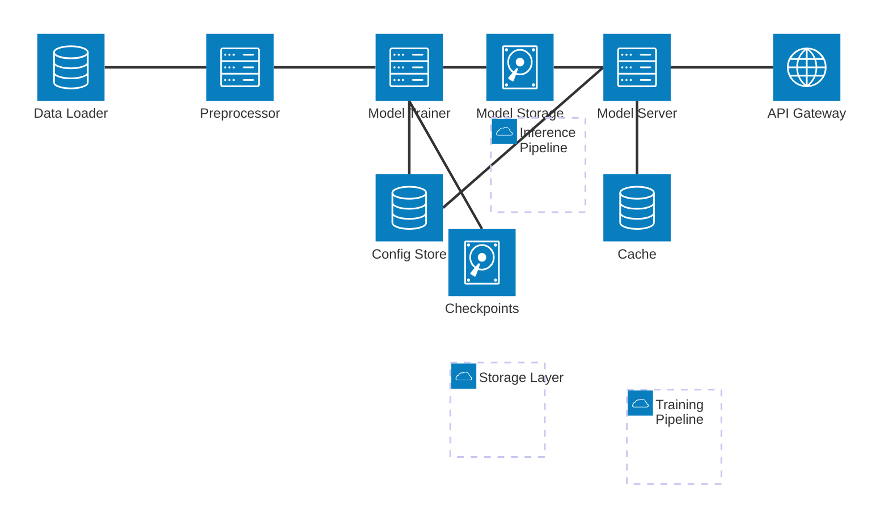

# Custom Neural Networks

[](https://codecov.io/gh/yourusername/customneuralnetworks)

A high-performance C++ neural network library designed for scalability and efficiency. This library supports training large models with features like gradient checkpointing, OpenMP parallelization, and efficient memory management.

## Features

- **High Performance**
  - OpenMP parallelization for multi-threaded training
  - Efficient memory management
  - Optimized matrix operations

- **Model Architecture**
  - Dense (Fully Connected) layers
  - ReLU activation with leaky variant
  - Support for large models (up to 27B parameters)
  - Gradient checkpointing

- **Training Features**
  - Mini-batch training
  - Early stopping
  - Progress monitoring
  - Loss computation and tracking
  - Data shuffling

- **Model Persistence**
  - JSON-based model serialization
  - Save and load model weights
  - Configuration management

## Architecture



## Requirements

- C++20 compatible compiler
- CMake 3.28 or higher
- OpenMP support
- nlohmann_json library (automatically downloaded by CMake)

## Building

1. Clone the repository:
```bash
git clone https://github.com/yourusername/customneuralnetworks.git
cd customneuralnetworks
```

2. Create build directory:
```bash
mkdir build && cd build
```

3. Configure and build:
```bash
cmake ..
make
```

## Usage Example

```cpp
#include "NeuralNetwork.hpp"

// Create model
nn::Model model(0.01f);  // learning rate = 0.01

// Add layers
model.add_layer(std::make_unique<nn::DenseLayer>(2, 8));
model.add_layer(std::make_unique<nn::ReLU>());
model.add_layer(std::make_unique<nn::DenseLayer>(8, 1));

// Train model
model.train(training_data, targets, 100, 32);  // 100 epochs, batch size 32

// Save model
model.save("model.json");

// Load model
nn::Model loaded_model(0.01f);
loaded_model.load("model.json");

// Make predictions
auto prediction = model.predict(input_data);
```

## Project Structure

```
customneuralnetworks/
├── include/
│   └── NeuralNetwork.hpp
├── src/
│   ├── NeuralNetwork.cpp
│   ├── Model.cpp
│   └── ReLU.cpp
├── docs/
│   ├── architecture.md
│   └── examples/
├── tests/
├── CMakeLists.txt
├── LICENSE
└── README.md
```

## Contributing

Contributions are welcome! Please feel free to submit a Pull Request.

1. Fork the repository
2. Create your feature branch (`git checkout -b feature/AmazingFeature`)
3. Commit your changes (`git commit -m 'Add some AmazingFeature'`)
4. Push to the branch (`git push origin feature/AmazingFeature`)
5. Open a Pull Request

## License

This project is licensed under the MIT License - see the [LICENSE](LICENSE) file for details.

## Acknowledgments

- OpenMP for parallel computing support
- nlohmann/json for JSON serialization
- CMake build system
