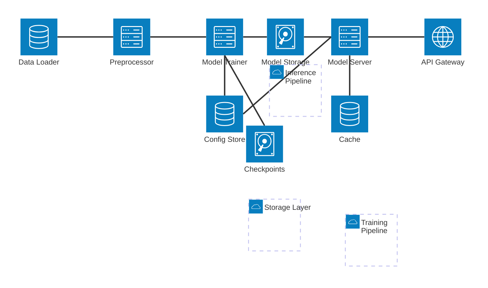

# Neural Network Architecture

## System Architecture

## Component Description

### Training Pipeline
- **Data Loader**: Handles input data loading and batching
- **Preprocessor**: Data preprocessing and augmentation
- **Model Trainer**: Core training logic with support for 27B parameter models
- **Checkpoints**: Manages model checkpoints and versioning

### Inference Pipeline
- **Model Server**: Serves trained models for inference
- **API Gateway**: Handles external requests and load balancing
- **Cache**: Caches frequent predictions for performance

### Storage Layer
- **Model Storage**: Persistent storage for trained models
- **Config Store**: Configuration management and hyperparameters

## Implementation Details

### Model Architecture
- Base architecture compatible with 27B parameter models
- Support for Vishwamai7b-style architecture
- Optimized for local training and inference
- Gradient checkpointing for memory efficiency
- Mixed precision training support

### Training Features
- Distributed training support
- Gradient accumulation
- Dynamic batch sizing
- Memory-efficient attention mechanisms
- Custom loss functions and optimizers

### Inference Optimizations
- Model quantization support
- Batched inference
- Caching layer for frequent requests
- Dynamic tensor operations
